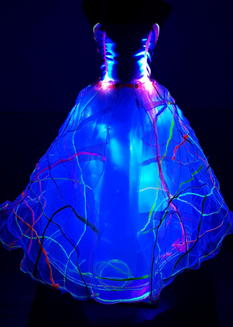
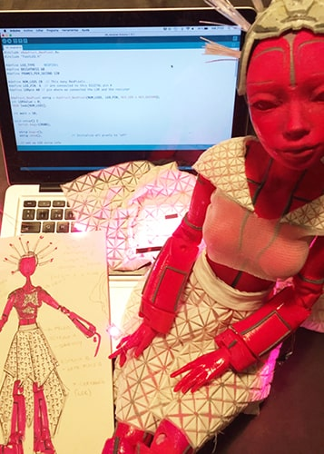
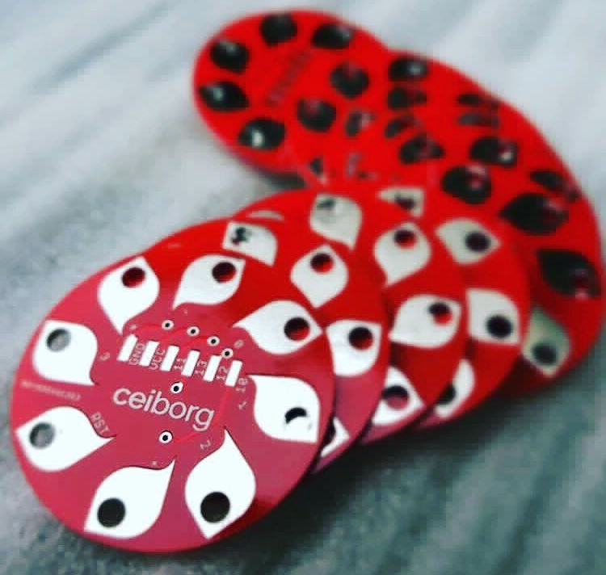

Ceiborg es un laboratorio creativo que vincula arte textil y vestuario con ciencia y tecnología.

Desarrolla sus tecno-textiles mediante diversas herramientas y técnicas:
  * electrónica y programación para crear electro-textiles
  * modelado e impresión 3d para producir textiles impresos
  * cultivo de hongos y bacterias para generar bio-textiles

Ceiborg es la conjunción de las palabras ceibo (flor nacional argentina) y cyborg (cyber organism).

  > **ceibo** + **cyborg** = **ceiborg**

| | |
|-|-|
|||
|||

---   

Ceiborg fue fundado por **Eliana Guzmán** en el año 2016. Eliana es Diseñadora de Indumentaria y Textil (UADE), Vestuarista y Artista Tecno-Textil.

Mas información en [ceiborg.com](https://ceiborg.com/)

