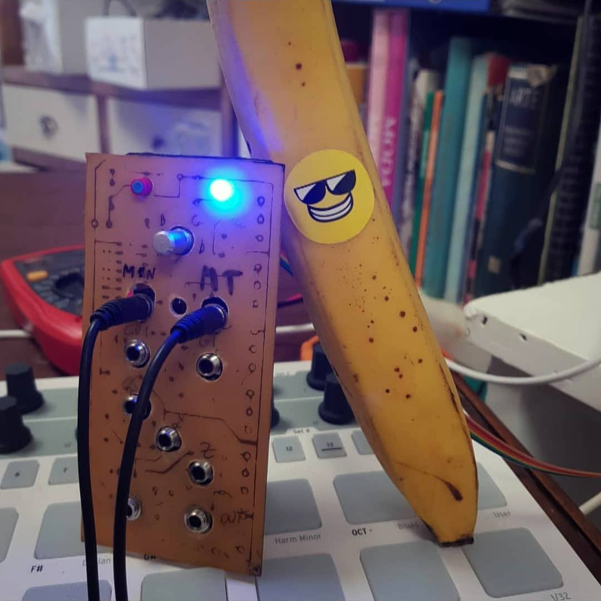

CV2612 is an eurorack module based on the classic FM chip used by Sega Genesis: the  great YM2612.  
It has MIDI i/o, and yes! it has **control voltage inputs**!  
It is on its final development stage and we hope to see it on the market soon.

### MIDI Specs

CV2612 has two 3.5mm TRS MIDI connectors: MIDI In and MIDI Out.
MIDI Out can act as a software MIDI Thru if **THRU_ENABLE** is **1**.

#### Note Messages

Note On/Off messages are received on channels 1 to 7
If received on channel 1, they treated differently based on **Poly Mode** configuration
  * If **Poly Mode** is set to **Mono**, a note will use all six voices
  * If **Poly Mode** is set to **Poly**, a note will use a single voice with up to 6 voices of polyphony, first in/first out.
Otherwise, notes on channels 2-7 goes to voices 1-6 respectively.

#### Pitch Bend Messages

Pitch Bend messages are received on channels 1 to 7
If received on channel 1, they affects all six voices
Otherwise, pitch bends on channels 2-7 affects voices 1-6 respectively.

#### Received CC/NRPN Messages

CC messages received are on channels 1 to 16
Every CV2612 voice related parameter is mapped to a CC message by default according to the following table, but can be configured through the [CV2612 Online Tool](/en/labs/cv2612)

MIDI DIN runs at 31250 bits per second. That's roughly 3000 bytes per second, which in a MIDI stream transferring CC data (3 bytes each) as quickly as possible, works out to about 1000 CC changes per second.

play-mode
vel-sensitivity
cc-mode
rgb-intensity

As a general rule, a parameter on MIDI channel 1 apllies to all six voices, and on Midi channel 2 to 7, applies to voices 1 to six respectively.
Global parameters do not take into account the MIDI channel used.

| NRPN MSB | NRPN LSB | CC | Channel | Code      | Parameter                          |
|----------|----------|----|---------|-----------|------------------------------------|
|          |          |    |         |           |*Global Parameters*                 |
|    01    |    0     | 1  | -       | LF0_F     | Low Frequency Oscillator Frequency |
|    02    |    0     | 2  | -       | LF0_E     | Low Frequency Oscillator Enable    |
|    03    |    0     | 3  | -       | THRU_E    | Enable Software MIDI Thru          |
|    04    |    0     | 4  | -       | TX_CC     | Transmit CC                        |
|    05    |    0     | 5  | -       | POLY_M    | Poly Mode (Mono/Poly)              |
|          |          |    |         |           |*Channel Parameters*                |
|    20    |    0     | 20 | 1-7     | AL        | Operators Algorithm                |
|    21    |    0     | 21 | 1-7     | FB        | Feedback of Operator 1             |
|    22    |    0     | 22 | 1-7     | FMS       | Frequency Modulation Sensitivity   |
|    23    |    0     | 23 | 1-7     | AMS       | Amplitude Modulation Sensitivity   |
|    24    |    0     | 24 | 1-7     | ST        | Stereo Configuration               |
|          |          |    |         |           | *Operator 1 Parameters*            |
|    30    |    0     | 30 | 1-7     | AR        | Attack Rate                        |
|    31    |    0     | 31 | 1-7     | D1        | Decay 1 Rate                       |
|    32    |    0     | 32 | 1-7     | SL        | Sustain Level                      |
|    33    |    0     | 33 | 1-7     | D2        | Decay 2 Rate                       |
|    34    |    0     | 34 | 1-7     | RR        | Release Rate                       |
|    35    |    0     | 35 | 1-7     | TL        | Total Level                        |
|    36    |    0     | 36 | 1-7     | MUL       | Frequency Multiplier               |
|    37    |    0     | 37 | 1-7     | DET       | Detune                             |
|    38    |    0     | 38 | 1-7     | RS        | Rate Scaling                       |
|    39    |    0     | 39 | 1-7     | AM        | Amplitude Modulation Enable        |
|          |          |    |         |           | *Operator 2 ...*                   |
|    40    |    1     | 40 | 1-7     | AR        | Attack Rate                        |
|          |   ...    |    |         |           | *Operator 3 ...*                   |
|    50    |    2     | 50 | 1-7     | AR        | Attack Rate                        |
|          |   ...    |    |         |           | *Operator 4 ...*                   |
|    60    |    3     | 60 | 1-7     | AR        | Attack Rate                        |
|          |   ...    |    |         |           |                                    |
|          |          |    |         |           | * Commands *                       |
|    70    |    0     | -  | -       | -         | Set a patch                        |
|    71    |    1     | -  | -       | -         | Select a patch                     |

#### Transmitted CC Messages

A few CC messages are transmitted on channels 1 if **TX_CC** is **1** .

| CC | Channel | Code      | Parameter                          |
|----|---------|-----------|------------------------------------|
| 1  | 1       | CV_MSB    | Control Voltage MSB                |
| 2  | 1       | CV_LSB    | Control Voltage LSB                |
| 3  | 1       | GATE      | Gate                               |
| -  | -       |           |                                    |
| 10 | 1       | X_MSB     | X MSB                              |
| 11 | 1       | X_LSB     | X LSB                              |
| 12 | 1       | Y_MSB     | Y MSB                              |
| 13 | 1       | Y_LSB     | Y LSB                              |
| 14 | 1       | Z_MSB     | Z MSB                              |
| 15 | 1       | Z_LSB     | Z LSB                              |

#### SysEx Messages

Other configuration parameters though, can only be changed with sysEx messages through the [CV2612 Online Tool](/en/labs/cv2612)

As a brief description, the following sysex messages are received:
  * ID_REQUEST
  * PARAM_LOAD
  * MAPPING_DUMP_REQUEST
  * MAPPING_LOAD
  * VOICE_DUMP_REQUEST
  * VOICE_LOAD
  * PATCH_DUMP_REQUEST
  * PATCH_LOAD
  * PATCHES_DUMP_REQUEST
  * PATCHES_LOAD

And the following sysex messages are transmitted:
  * ID_REPLY
  * MAPPING_DUMP_REPLY
  * VOICE_DUMP_REPLY
  * PATCH_DUMP_REPLY
  * PATCHES_DUMP_REPLY

Being
  * ID: Identity of the device
  * PARAM: a single parameter
  * MAPPING: The CC to parameters mapping
  * VOICE: a single voice in the chip, a.k.a. channel
  * PATCH: a patch is comprised of 6 voices, lfo and ploymode  settings
  * PATCHES: a set of 4 patches

Happy FMing!

