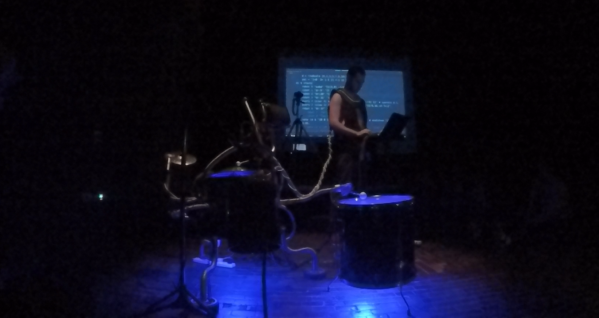

**Música Asistida por Humano** is a Human-Machine percussion duo where the machine learns from the human. It proposes a fluid dialogue between both, to the point where no one distinguishes who leads the music.

The work speaks about the creation of artificial life from an artistic perspective, wondering whether a *funky-drummer-machine* that can hold a musical conversation with a person could be credible spectacle.
Credible not in the sense of deception, but in the sense of recognizing the human trace in the machine.

> *Would the spectator come to feel that in the machine, although in a rudimentary way, there is life?*

Even with a specific *funky-drumming* constraint, it poses delicate questions. What is the purpose of making a machine play the drums if we already have good drummers?
What is the purpose of artificial life?  **Why Golems? Why Frankenstein's creatures?**

The creation of life is associated with **horror**: *will we create monsters? will the machines replace us?* But associated also with the greatest desires of the human being: the search for immortality and the breaking of all limits

| | |
|-|-|
|||

> *When you think of the Golem or Frankenstein, would you say they are human?
Would you say that they are not?*

We are still talking about *funky-drumming* ... but if we manage to transfer the skills of a drummer to an artificial intelligence program, what could we not, potentially?

---

### Presentation

> The AI side of this project is still in development. *But I was anxious to give it a try so here I'm livecoding the machine along with some synths.*

`video: https://youtu.be/aoeT3bze25c`

> *UNSAM, BsAs, Argentina, December 2018. No AI yet: the machine is being live-coded*

As an installation, the work will be available to the public with proper explanations of use, to promote participation and experimentation to communicate with a machine musically.
As a performance it will be short presentations where the performer tries to make it evident to the audience that he is guiding the performance. At the beginning you will see how the machine tries to learn, and in the end how it accompanies the performer in duo.

---
### Aesthetics

The aesthetic proposal is to humanize the machine and "machinize" the human with the intention that this crossing will provoke the feeling of approach between them. Elements normally associated with the human are be transferred to the machine and vice versa.

| | |
|-|-|
|||

While the machine strikes acoustic percussive bodies with electromagnetic actuators, the human have digital gear with synthetic sounds.
The title also plays with this aesthetic cross: the term *computer-aided music* has been known for years, in which the human composer uses the machine to solve technical and high precision tasks in order to carry out his work. Here we propose the opposite: it is the machine who "composes", but needs the assistance of a human to inject emotion into his work.

The machine has a *machine-animal-humanoid* hybrid aspect without gender definition. It has all the signs of the imperfect and *unfinishedness*: lack of symmetry, fragments of different technologies and materials, and evidence of recent repairs.
> *A unique creature rather than a device. A clear trace of having been sired.*
