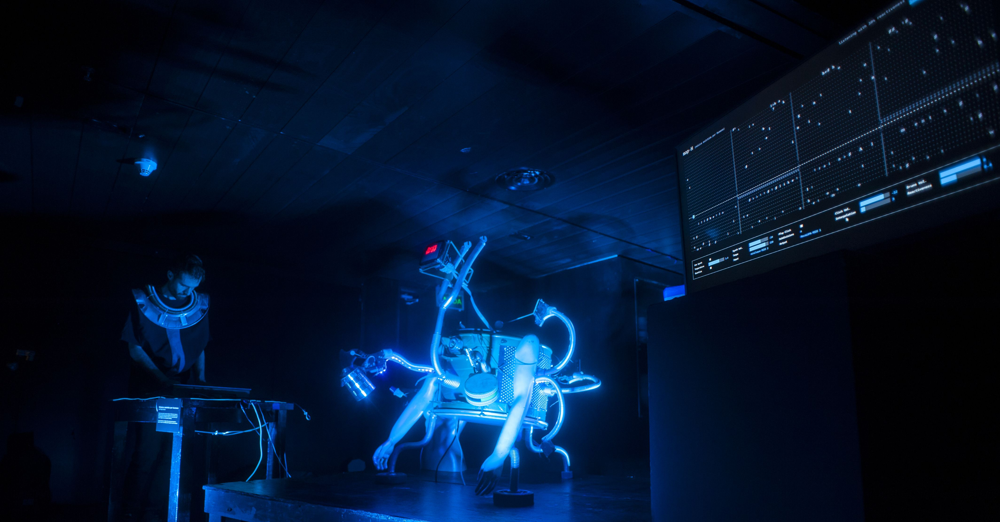
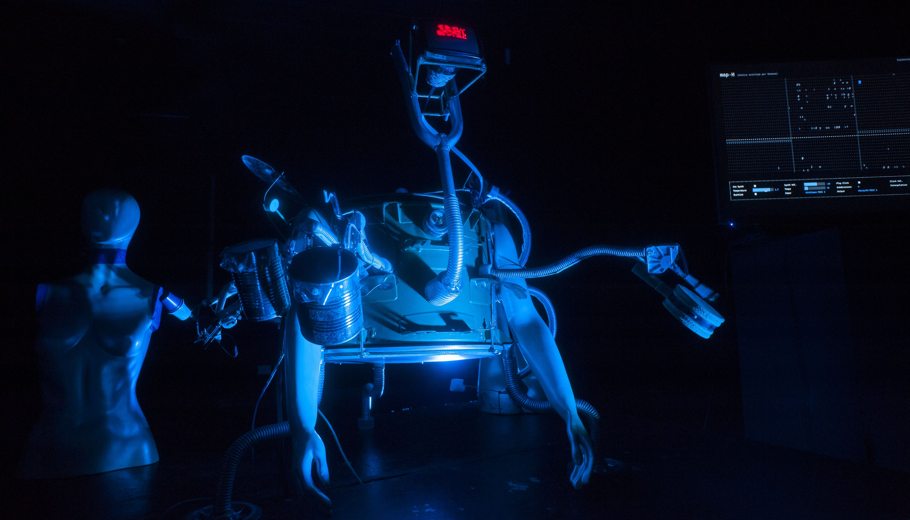
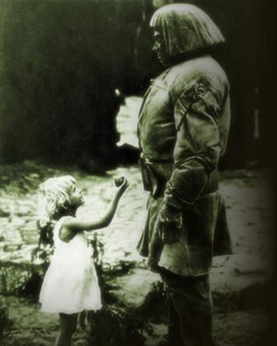
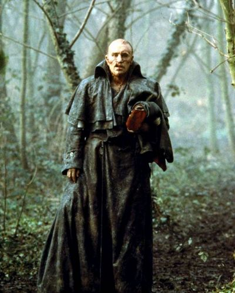
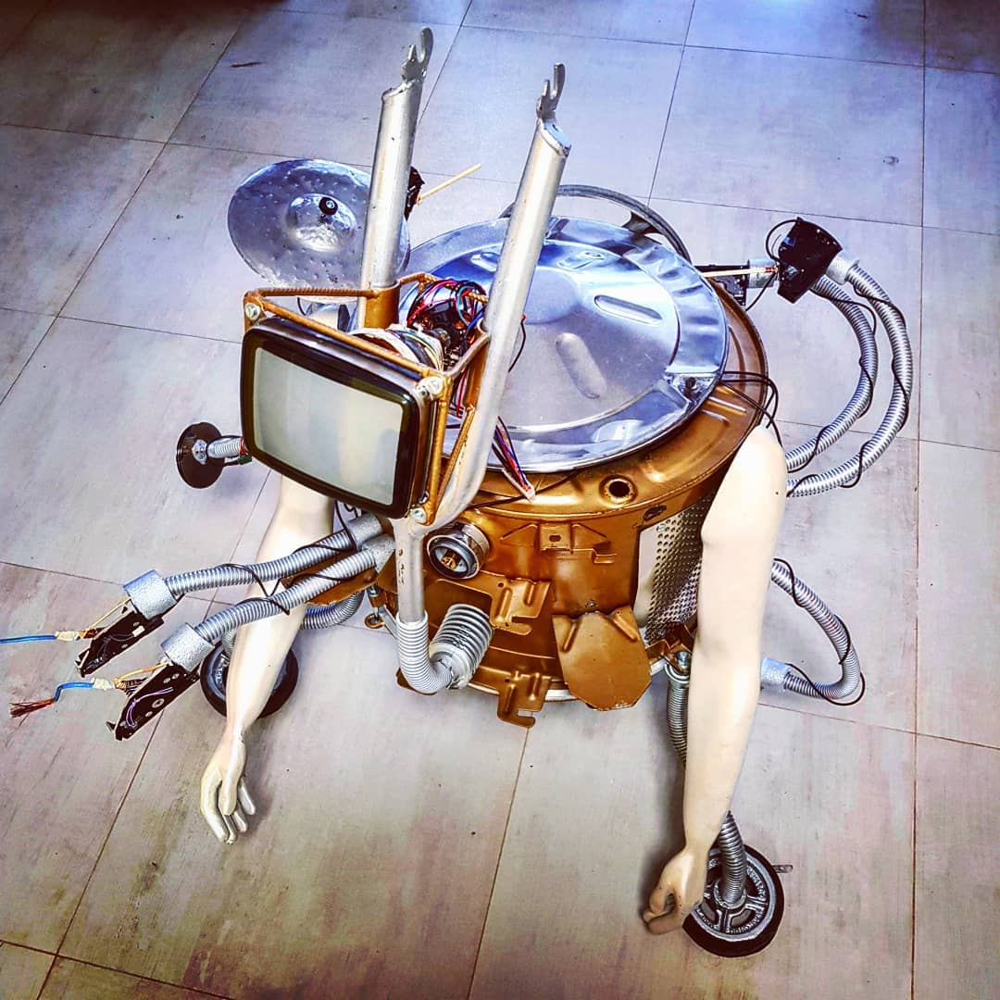
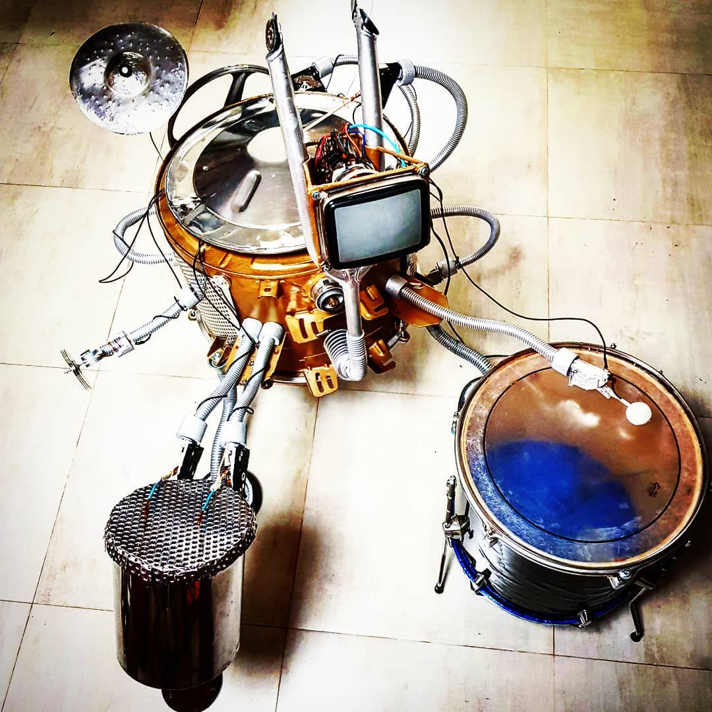

**Música Asistida por Humano** es un dúo de percusión Humano-Máquina en el cual la máquina aprende del humano. Propone un diálogo fluído entre ambos, al punto en que no se distinga quién lidera la música.

Se trata de una escultura robótica, llamada Bernardo, dotada de un programa de inteligencia artificial capaz de acompañar musicalmente a un intérprete humano.

La obra habla sobre la creación de vida artificial desde una perspectiva artística, preguntándose si una máquina-baterista-funky que pueda mantener una conversación musical con una persona podría ser un espectáculo creíble. Creíble no en el sentido del engaño, sino en el sentido de reconocer el rastro humano en la máquina.

> ¿Llegaría el espectador a sentir que en la máquina, aunque de forma rudimentaria, hay vida?

Aún limitándose a un *baterista funky*, plantea cuestiones delicadas. 
¿Cuál es el propósito de hacer que una máquina toque la batería si ya tenemos buenos bateristas? 
¿Cuál es el propósito de la vida artificial? **¿Por qué Golems? ¿Por qué criaturas de Frankenstein?**

La creación de vida siempre asociada al **horror**: *¿crearemos monstruos? ¿Nos reemplazarán las máquinas?*   
Pero asociado también a los mayores deseos del ser humano: la búsqueda de la inmortalidad y la ruptura de todo límite.

| | |
|-|-|
|||

> Cuando piensas en el Golem o Frankenstein, ¿dirías que son humanos? ¿Dirías que no lo son?

Seguimos hablando de *bateristas funky* ... pero si logramos transferir las habilidades de un baterista a un programa de inteligencia artificial, ¿qué no podríamos hacer, potencialmente?

---

### Presentaciones

Presentación en el Centro Cultural San Martín, durante **Noviembre Electrónico 2019**.  
La obra fue seleccionada para el programa de residencias arte-ciencia SM2.

`video: https://youtu.be/C7oVKmWanwM`

Presentación en Universidad Naciona de San Martín, en diciembre 2018.  
La IA del proyecto aún estaba en desarrollo. Pero estaba ansioso por probarlo, así es que aquí estoy **livecodeando** a Bernardo junto con algunos sintetizadores.

`video: https://youtu.be/aoeT3bze25c`

---
### Estética

La propuesta estética es humanizar la máquina y "maquinizar" al humano con la intención de que este cruce provoque la sensación de cercanía entre ellos. Los elementos normalmente asociados con humanos se transfieren a la máquina y viceversa.

| | |
|-|-|
|||

Mientras que la máquina golpea cuerpos de percusión acústica con actuadores electromagnéticos, el ser humano tiene equipos electrónicos con sonidos sintéticos. 
El título juega también con este cruce: desde hace años se conoce el término música asistida por ordenador, en el que el compositor humano utiliza la máquina para resolver tareas técnicas y de alta precisión para realizar su obra. Aquí proponemos lo contrario: es la máquina la que “compone”, pero necesita la ayuda de un humano para inyectar emoción a su trabajo.

Bernardo tiene un aspecto híbrido máquina-animal-humanoide y todos los signos de lo imperfecto e inacabado: falta de simetría, fragmentos de diferentes tecnologías y materiales, y evidencia de reparaciones recientes.

> Una criatura única más que un dispositivo. Un rastro claro de haber sido engendrado.
