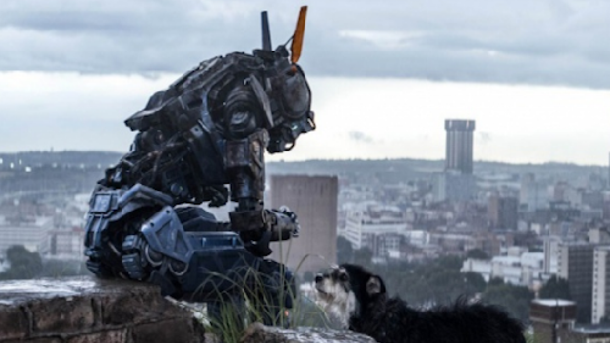

**Human Aided Music** is a Human-Machine percussion duo where the machine learns from the human. It proposes a fluid dialogue between both, to the point where no one distinguishes who leads the music.

The work speaks about the creation of artificial life from an artistic perspective, wondering whether a *funky-drummer-machine* that can hold a musical conversation with a person could be credible spectacle.
Credible not in the sense of deception, but in the sense of recognizing the human trace in the machine.

*Would the spectator come to feel that in the machine, although in a rudimentary way, there is life?*

Even with a specific *funky-drumming* constraint, it poses delicate questions. What is the purpose of making a machine play the drums if we already have good drummers?
What is the purpose of artificial life? Why Golems? Why Frankensteins?

The creation of life is associated with horror: will we create monsters? will the machines replace us? But associated also with the greatest desires of the human being: the search for immortality and the breaking of all limits

| | |
|-|-|
|||

*When you think of the Golem or Frankenstein, would you say they are human?
Would you say that they are not?*

We are still talking about *funky-drumming* ... but if we manage to transfer the skills of a drummer to an artificial intelligence program, what could we not, potentially?

---

### Presentation

The work will have two modalities: installation and performance.
As an installation, the work will be available to the public with proper explanations of use, to promote participation and experimentation to communicate with a machine musically.
As a performance it will be short presentations where the performer tries to make it evident to the audience that he is guiding the performance. At the beginning you will see how the machine tries to learn, and in the end how it accompanies the performer in duo.

UNSAM, BsAs, Argentina, December 2018. Not being AI yet: the machine is being live-coded

---
### Aesthetics

The aesthetic proposal is to humanize the machine and "machinize" the human with the intention that this crossing will provoke the feeling of approach between them. Elements normally associated with the human will be transferred to the machine and vice versa.
While the machine will strike acoustic percussive bodies with electromagnetic or pneumatic actuators, the human will have a digital percussive instrument with synthetic sounds.
The title also plays with this aesthetic cross: the term "computer-aided music" has been known for years, in which the human composer uses the machine, which solves technical and high precision tasks, in order to carry out his work. Here we propose the opposite: who "composes" is actually the machine, but needs the assistance of a human to inject emotion into his work.

The machine will have a machine / animal / humanoid hybrid aspect without gender definition. It will have all the signs of the imperfect and unfinished: lack of symmetry, fragments of different technologies and materials, and evidence of recent repairs. A unique creature rather than a device. A clear trace of having been sired.

*Chappie has been a great source of inspiration*

---
### Technique

The machine will analyze what the human is doing, and based on certain Machine Learning criteria will decide what to interpret. It won't be copying what the human being does:it will have the capacity to make "artistic" decisions.
Both the reception of human data and the sending of instructions to electromagnetic and pneumatic actuators will be done through the MIDI protocol.
The computation will be executed in a raspberry Pi, and the handling of peripherals will be done with an Arduino Uno.
For the analysis of the data and the generation of patterns, a pyton program will be written using the Magenta framework.
For the training of the model a selection of funky percussion scores will be made.
