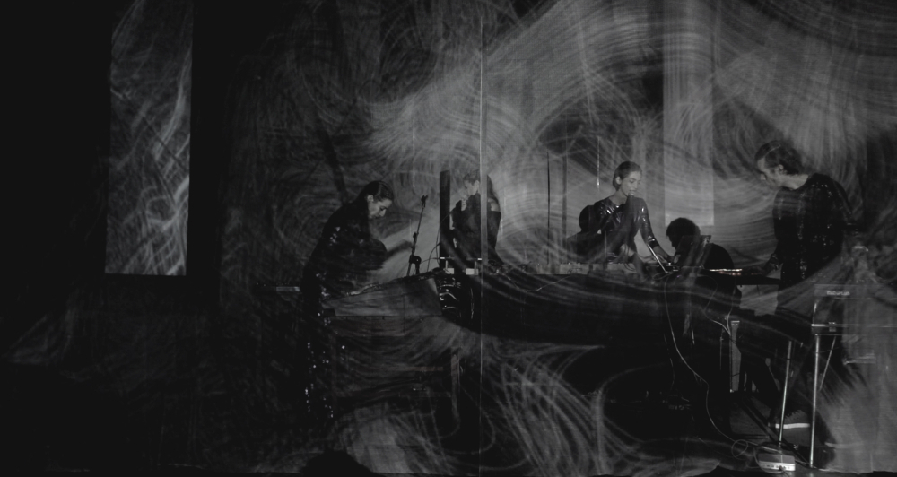

**I-O** is an audiovisual and scenographic performance about the recovery of our languages and the relationship with nature through a process of spiritual and material detoxification.

  <video autoplay loop muted style="max-width:100%">
    <source src="./intro.webm" type="video/webm" />
    <source src="./intro.mp4" type="video/mp4" />
  </video>

 

Inclusion and sustainability are at the core of this project that advocates recovering the native languages ​​that have been so neglected over the years as well as fosters a relationship with nature that seems to have been lost in time.

---
### Origin

The project began in november 2017, when [Josefina Barreix]() launched a solo EP produced with [Andrés Marino]() and published by [FUNGI Records]().

<iframe style="border: 0; max-width: 700px;width: 90%; height: 220px;" src="https://bandcamp.com/EmbeddedPlayer/album=2520081075/size=large/bgcol=333333/linkcol=ffffff/artwork=small/transparent=true/" seamless></iframe>

 

<a href="https://fungirecords.bandcamp.com/album/instrumento-ptico">Bandcamp</a>
| <a href="https://open.spotify.com/album/3TxWEBQPKrpgCBArsjTbwU">Spotify</a>
| <a href="https://soundcloud.com/jsfnbrrx/sets/instrumento-optico">Soundcloud</a>
| <a href="https://itunes.apple.com/us/album/instrumento-%C3%B3ptico-single/1310744889">Itunes</a>

  

The album was composed and produced by Josefina Barreix & Andres Marino, mixed by Pablo Del Fauno Gil & Andrés Marino in *Ideo Music Studio*, and mastered by Pablo Del Fauno Gil in *La Siesta del Fauno Studio-Lab*.

The album was a success and attracted the attention of many people who wanted to take part on it. That is why it has featuring Flor Wosh (choirs in "Dysecdysis"), Ernesto Romeo (synthesizers in "Incorporo"), Violeta García (violoncello in "Incorporo"), Santiago Colombatto (bowls in "Incorporo"), Abelardo Saravia (choirs in "Incorporo"), Melina Moguilevsky (choirs in "Incorporo"), Guillermina Teves (album cover) and Lea Bon (photography).

Even [Indie Rock Magazine](http://www.indierockmag.com/) got interested and wrote an [article about it](http://www.indierockmag.com/article31854.html).

All this excitement led to the idea of ​​taking the EP to the next level, transforming it into an **audiovisual and scenographic performance**.

---
### Concept

Although during the presentation words are expressed vocally both in Spanish and Ranquel (native language spoken by pre-columbian cultures), abstract emotional sounds take the actual spotlight. Words sometimes serve as barriers, obfuscating true purpose and emotion.

>>>>*There are universal sounds capable of overcoming the inevitable distances inherent of dialects and languages. Sound, as a primary language is the first step towards personal detoxification.*

The opus is comprised of four moments of a mythical story: "Euphoria", "Dysecdysis", "Diaphanus" and "Incorporo".

>#### Euphoria
>Dopamine fills the brain with a feeling of confidence and an exaggerated sense of well-being. The self-exalted individual seeks for internal shelter; isolation and solitude follow. Reality does not satisfy his desires and leads him to deep disappointment and the need to rebel against the established.

>#### Dysecdysis
>Named after a condition which causes failure in reptiles' outer skin shedding. This process of detoxification can only be overcome by the replacement of the old by the new.

>#### Diaphanus
>Transparent or translucent; allows light to pass through. It means to appear, not in a deceptive way, but to show what is manifestly real, what is perceivable by the senses and has strength of evidence.

>#### Incorporo
>In order for the human being to learn something from nature, other intelligences must exist before nature itself, without a body, volume or consistency. These intelligences belong to the spirit and cannot be perceived by the senses.

---
### Aesthetics

The voice is a broad instrument that oscillates from recognizable human uses such as tribal screams, whispered poems, ritual choirs and gated vocals towards less familiar digital textures such as granular percussion, background echo and synthesized pads.

Melancholic Wurlitzers and increasingly tense cellos harmonize the sound universe while the rhythm is given by multiple lines of synthetic bass, stuttered drums and samples ranging from metal, glass and fire to jungle field recordings.

The visual aspect deals with an absence of tone leaving the main voice to be highlighted with a specially handcrafted red cape. An abandoned temple emerges in the vast ocean, suspended in a three-dimensional void.
Matter evolves from lonely dust to glowing particles, organically alive and extremely sensitive to sound.

---
### Presentations

Since its inception, IO was presented in the following venues.

* 03/18  | Chela Cultural Center´ | Buenos Aires, AR
* 09/18  | UNTREF´´´´´´´´´´´´´´´´ | Buenos Aires, AR
* 09/18  | Roseti Cultural Center | Buenos Aires, AR
* 12/18  | La casa de la pampa´´´ | Buenos Aires, AR
* 02/19  | La Invisible´´´´´´´´´´ | Montevideo, UR   

`video: https://youtu.be/_gTlaWTMAgI`
