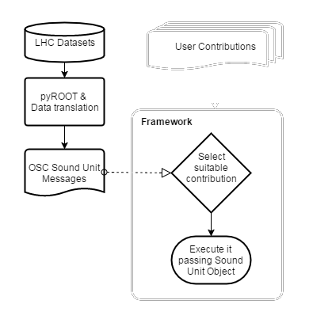

*Large Hadron Collider Visual Music Machine* is an [Opensemble](http://opensemble.github.io/) project. It is a visual music project based on data generated by the Large Hadron Collider , the world's largest and most powerful particle accelerator located at CERN in Switzerland.

`video: https://vimeo.com/191642319`

---
### Understanding Visual Music

The work was presented at the concert given at the **Galileo Galilei Planetarium** in the City of Buenos Aires in November 2016 as part of the **Noviembre Electrónico**.

It was developed by a multidisciplinary team representing the National Technological University of the City of Buenos Aires within a Fulldome Workshop called **Understanding Visual Music** conducted by the **Galileo Galilei Planetarium** and the Center for Experimentation and Research in Electronic Arts (CEIArtE ) of the National University of Tres de Febrero, in collaboration with UNTREFMEDIA, the National Technological University and the Cultural San Martín

---
### About Opensemble and L.H.C.V.M.M.

[Opensemble](http://opensemble.github.io/) is an *Algorithmic music collaborative ensemble*, [Opensemble](http://opensemble.github.io/)

[Opensemble](http://opensemble.github.io/) is also the name of a framework for collaborative algorithmic music. It employs the software engineering techniques used by the Open Source development model to discover the music that this kind of distributed and large scale collaboration can offer.

The goal of **L.H.C.V.M.M.** was to translate the data generated by the ATLAS detector , one of the four major LHC experiments, into stimuli for the musical composition and performance.

These initial questions emerged:
 * What common language could we adopt to describe a piece of music without tying it to a specific work?
 * How to translate ATLAS data into a descriptive
piece of music to drive both music and visuals?
 * What will be the framework to manage collaborations in such a work?

---
### The Framework

We developed framework  in [Supercollider](https://supercollider.github.io/) responsible for managing collaborations, receiving sound unit OSC messages, and finally reproducing the music.

Collaborators register functions that implement sonically *sound units* matching certain *spectromorphologic vocabulary terms* by calling a method on the framework. Those functions receive a *sound unit object* as argument allowing collaborators to use its properties on their implementation.

Finally, the framework selects the most suitable registered function for each received OSC message and pass the sound unit object to the selected function. This selection is done based on the best match of vocabulary terms of function descriptions and sound unit object properties.

The work became [a paper](https://quod.lib.umich.edu/cgi/p/pod/dod-idx/opensemble-a-framework-for-collaborative-algorithmic-music.pdf?c=icmc;idno=bbp2372.2016.036;format=pdf) presented to the [Internacional Computer Music Association](http://www.computermusic.org/) at **ICMC2016**.

The following diagram can help to understand the data flow. For deeper details about the project, [download the paper](https://quod.lib.umich.edu/cgi/p/pod/dod-idx/opensemble-a-framework-for-collaborative-algorithmic-music.pdf?c=icmc;idno=bbp2372.2016.036;format=pdf) or dig into the [project repository](https://github.com/Opensemble/lhcvmm)

