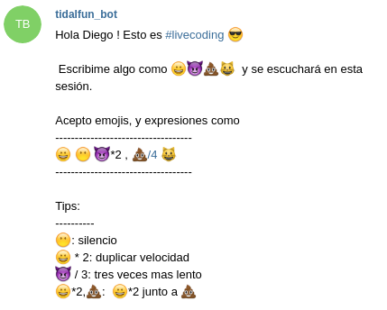
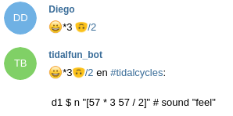
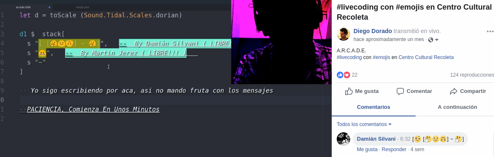
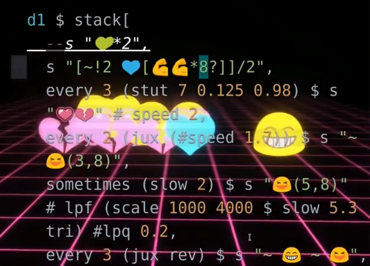

> *Livecoding is a form of performatic art and a creative technique based upon the use of improvised interactive programming. It is often performed in live presentations in which one or many Livecoders generate a progression of visuals and music displaying the code for the audience to see.*


Live-emojing is a Livecoding technique I developed with the intention of including the audience in the performance. Spectators input  patterns in an intuitive manner by sending series of **emojis** via social networks.


Besides my interest  in having the audience participate in the performance, I have the intention of bringing down the idea that programming is inaccessible. Socializing the code by inviting the spectator to intervene.

I found in **emojis** a key to attract the public to reading the code. It’s appeal comes as a result of it being both a very familiar element and at the same time very antinatural to programming languages. *This contrast makes it stand out.*

> ## **Emojis communicate quickly, easy and make no language distinction.**

---
## Some Performances

<br/>

#### First Streaming
`video: https://youtu.be/OwKUuypxP6Y?t=29m57s`

<br/>

#### #WorldEmojiDay 2018 at [Centro Cultural Recoleta](http://www.centroculturalrecoleta.org/)
`video: https://youtu.be/6HVmAN7bScQ`

<br/>

#### VIU Festival at [Hangar.org](https://hangar.org/en/), Barcelona
`video: https://youtu.be/0BCenu-jz8s`


---

## Motivation

My interest to make the audience take part in the livecoding experience brought to me the idea of *livecoding with emojis*

I had previously tried to reach out for such interaction by other means.

* **Enlarging the font** to its maximum size so that reading the code would be comfortable to the audience.

>>> ##### `tidal¬d1 $ stack [  n "<1 2>*8" # s "feel" # lpf (slow 4.4 $ scale 600 4000 $ tri) # lpq 0.051,  jux (# speed (scale (-0.5) 1 $ slow 3.2 $ tri)) $ whenmod 16 14 (const $ s "swsn:1*6" # speed (scale 2 1 $ slow 2 $ sine) # orbit 3 # room 0.2) $ s "[swbd:3 <swsn:3 swsn:3 swsn:1 [swsn:3 swsn:3]>]" # orbit 3 # room 0.2 # dilei 0.25 0.25 0.5,  n (d $ "{0 0 7 0 7}%4"+p) # s "bass8"# gain 0.95,  note (d $ (every 3 (const $ "[0,7](3,8)") $ every 4 (const $ "0*8") $ "0*2") + "[0,2,4,6]"+7+p) # m "[2,3]" # sustain 0.25 # gain 0.7,  note (d $ slow "<1 2>" $ "0 .. 3"+"<0 1 2>"+p) # m "6" # gain 0.9 # sustain 0.5,  s "~"]`
>>> *versus*
>>> # `tidal¬d1 $ sound "[drums, bass*2]"`


>> *Larger font size invites us to read it.*

* **Starting out from a blank page** with simple sequences that were easy to relate to the audio being generated and gradually becoming more complex.

>>>```tidal
>>>d1 $ sound "bd"
>>>-- ...
>>>d1 $ sound "bd*2"
>>>-- ...
>>>d1 $ sound "bd*2 sn"
>>>-- ...
>>>d1 $ sound "[bd*2 sn, hh*8?]"
>>>```


>> *The blank sheet generates a lot of curiosity and gives an opportunity to try to follow the initial logical sequences*

* **Code Localization**. I created aliases in our native language of some function names or code blocks to replace their original English names as a way to engage Non-English speakers during presentations.


>>>```tidal
>>>let pista1 = d1
>>>     pista2 = d2
>>>     sonido = sound
>>>     cada_tanto = sometimes
>>>     despacito = slow 4
>>>     primeros_8 = run 8
>>>     empezar_desde = begin
>>>
>>>pista1 $ sonido "bombo tacho" # comprimir 0.2
>>>
>>>pista2 $ cada_tanto despacito $ primeros_8
>>>   $ sonido "numbers" # empezar_desde 0.2
>>>```


>>*Displaying the code written in native language draws attention, eliminates the difficulty of the language barrier and focuses attention on what the code is really about.*


---
## First Prototype

Initially I wrote a haskell function to map 7 emojis to 7 different samples in tidalcycles’ livecoding environment.
In this first proof of concept the emojis were not received but rather typed in the Atom editor (thanks to the autocomplete-emojis package)

*Emojis mapping function in Tidalcycles*
```tidal
emoji x = sound (fromString $ concatMap (\c) ->
   if c == '💚' then s "bd:6"
   else if c == '✊' then s "sn:4"
   else if c == '😬' then s "dr"
   else if c == '😎' then s "dr:1"
   else if c == '👄' then s "feel:1"
   else if c == '💋' then s "kiss:2"
   else if c == '😘' then s "kiss"
   else if c == '😸' then s "cat"
)

d1 $ emoji "💚(3,8) ✊*2"
```

---
### Including Telegram

I thought then that it would be fun to receive the emojis from the public, so I created a Telegram bot to interact with the audience.

I developed an Atom plugin to handle messages received by the bot. These messages are automatically inserted by the plugin in certain positions of the editor.
They remain occupied for 30 seconds by the same person. A countdown urged them to continue the game by updating the pattern or risk that someone else takes their place.

The bot starts the conversation with a message explaining the rules of the game



Upon receipt of a message, the bot would include it in the presentation and a possible tidalcycles pattern translation of the message would be responded to the sender.



---
### Including Facebook

As I usually streamed the performance through Facebook, several people who did not knew about Telegram sent me the emojis via facebook chat. I understood that it would be a simpler process for the audience to participate by using those Facebook messages rather than asking them to install Telegram and write to the bot.

So, I wrote a Chrome extension that would scrape the Facebook page looking for messages containing emojis in the streaming chat and send them back to the Atom plugin via websockets.


*You can see the comment by Damian Silvani appear in streaming video, next to his name*


In this way, a spectator, present in the audience or following the stream remotely, could send an "emoji algorithm" via Telegram or via Facebook and see the contribution next to his or her user name projected (or streamed) live.

Eventually, even someone without any livecoding experience could relate the pattern of emojis sent with the pattern of sounds being generated  by that intervention.

**This last point would be an educational path of minimum difficulty with the objective of   introducing someone to the idea of programming applied to art.**

---
### Including Reactive Visuals


Once the interaction with the spectator was completed, I continued to develop a better graphic representation of the patterns with the intention of making it even clearer and more attractive.
I included in the session a 3D scenario that runs as background to the editor and that responds visually to each sound event generated by the emoji patterns. This further facilitates the relationship between the sent emojis and the generated sounds.




---
## About emoji to sample mapping

It is not possible to foresee the emojis that I would receive. Initially I took the decision of using  the unicode value of the emoji as the index to be played from a folder of samples (strictly speaking, the rest of the division by the number of possible samples). This was comfortable, but not very useful, since the samples were repeated very often and it was not possible to guess the sound to be played.


I started working on an alternative. Mapping all existing emojis was too much work. Someone must have made a list of the most popular emojis. I found something much better: emojitracker.com, a site that tracks the emojis used on twitter in real time and ranks them.
I then took the most popular emojis and began to do a manual mapping, in a JSON file still in development, in which I grouped them by similarity.

```js
/*emojis.json*/
[
  ["😃😄😅😉😋😍😘😗😙😚","feel:"],
  ["😐😑😶😏😣😥😮😯😪😫😴😌😛😜😝😒😓😔😕😲","dr:"],
  ["😖😞😟😤😢😭😦😧😨😩😰😱😳😵😡😠","feel:"],
  ["😷","sick"],
  ["😇","face_role"],
  ["😈👿👹👺💀👻👽👾","fantasy"],
```

<br>

The goal is to achieve a correspondence between what the emoji represents visually and sonorously.
Currently, this correspondence is totally arbitrary, for example,
* 💙💚💛💜   sound like bass drums
* 👋👏🙌🙏 sound like claps
* 💪✊💪👊     sound like snare drums
* 😦😧😱😵 sound like chants

This makes it easier to understand how the emoji pattern sent should sound.  
Anyone can guess that `js¬💚*4` is equivalent to  `js¬💜*4`

---
## Future expectations:

I plan to continue with the development of these tools and take them to other environments. I have already done some tests on FoxDot.
I think they can be highly educational in the field of programming, as an introductory approach and as a means of spreading the practice of livecoding.
Due to the experience so far and the possibilities of extending this tool, I envision a new expressive medium to explore.
I am working to publish the repositories of these plugins with their respective documentation and instructions with certainty that new and interesting applications will emerge from their disclosure.

And above all:
## to have fun with emoji based music! 😆
